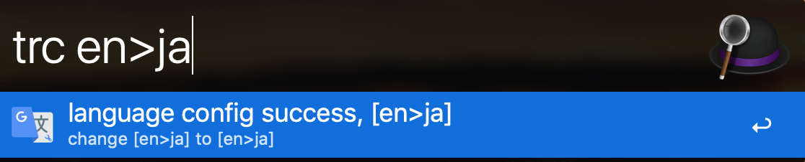

# alfred-language-configuration

## Install

*Requires [Node.js](https://nodejs.org) 4+ and the Alfred [Powerpack](https://www.alfredapp.com/powerpack/).*

- install with `npm install -g alfred-language-configuration`
- or [download](https://github.com/xfslove/alfred-language-configuration/releases/tag/v1.0.1) workflow

## [Changelog](https://github.com/xfslove/alfred-language-configuration/releases)

## Usage

Alfred workflow Keyword `trc`.

configuration format: `source language keyword>target language keyword`, and language key word see the [Supported Language List](#supported-language-list).

eg: `trc en>ja` means translate iuput from english to japanese.

## Snapshot

## Supported Language List

| keyword  | language |
| --------- | ------- |
|af|Afrikaans|
|sq|Albanian|
|am|Amharic|
|ar|Arabic|
|hy|Armenian|
|az|Azerbaijani|
|eu|Basque|
|be|Belarusian|
|bn|Bengali|
|bs|Bosnian|
|bg|Bulgarian|
|ca|Catalan|
|ceb|Cebuano|
|ny|Chichewa|
|zh-CN|Chinese Simplified|
|zh-TW|Chinese Traditional|
|co|Corsican|
|hr|Croatian|
|cs|Czech|
|da|Danish|
|nl|Dutch|
|en|English|
|eo|Esperanto|
|et|Estonian|
|tl|Filipino|
|fi|Finnish|
|fr|French|
|fy|Frisian|
|gl|Galician|
|ka|Georgian|
|de|German|
|el|Greek|
|gu|Gujarati|
|ht|Haitian Creole|
|ha|Hausa|
|haw|Hawaiian|
|he|Hebrew|
|iw|Hebrew|
|hi|Hindi|
|hmn|Hmong|
|hu|Hungarian|
|is|Icelandic|
|ig|Igbo|
|id|Indonesian|
|ga|Irish|
|it|Italian|
|ja|Japanese|
|jw|Javanese|
|kn|Kannada|
|kk|Kazakh|
|km|Khmer|
|ko|Korean|
|ku|Kurdish (Kurmanji)|
|ky|Kyrgyz|
|lo|Lao|
|la|Latin|
|lv|Latvian|
|lt|Lithuanian|
|lb|Luxembourgish|
|mk|Macedonian|
|mg|Malagasy|
|ms|Malay|
|ml|Malayalam|
|mt|Maltese|
|mi|Maori|
|mr|Marathi|
|mn|Mongolian|
|my|Myanmar (Burmese)|
|ne|Nepali|
|no|Norwegian|
|ps|Pashto|
|fa|Persian|
|pl|Polish|
|pt|Portuguese|
|pa|Punjabi|
|ro|Romanian|
|ru|Russian|
|sm|Samoan|
|gd|Scots Gaelic|
|sr|Serbian|
|st|Sesotho|
|sn|Shona|
|sd|Sindhi|
|si|Sinhala|
|sk|Slovak|
|sl|Slovenian|
|so|Somali|
|es|Spanish|
|su|Sundanese|
|sw|Swahili|
|sv|Swedish|
|tg|Tajik|
|ta|Tamil|
|te|Telugu|
|th|Thai|
|tr|Turkish|
|uk|Ukrainian|
|ur|Urdu|
|uz|Uzbek|
|vi|Vietnamese|
|cy|Welsh|
|xh|Xhosa|
|yi|Yiddish|
|yo|Yoruba|
|zu|Zulu|
